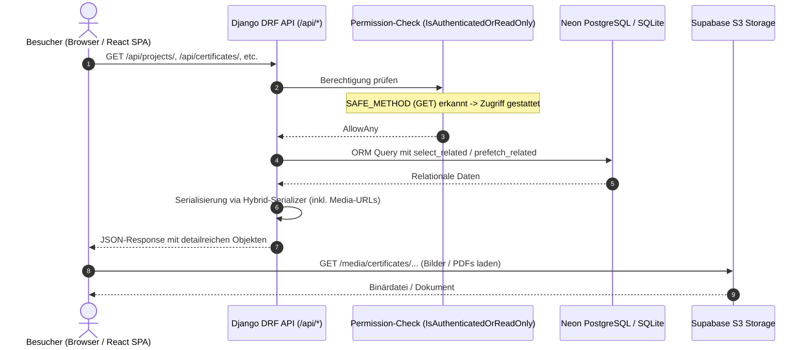
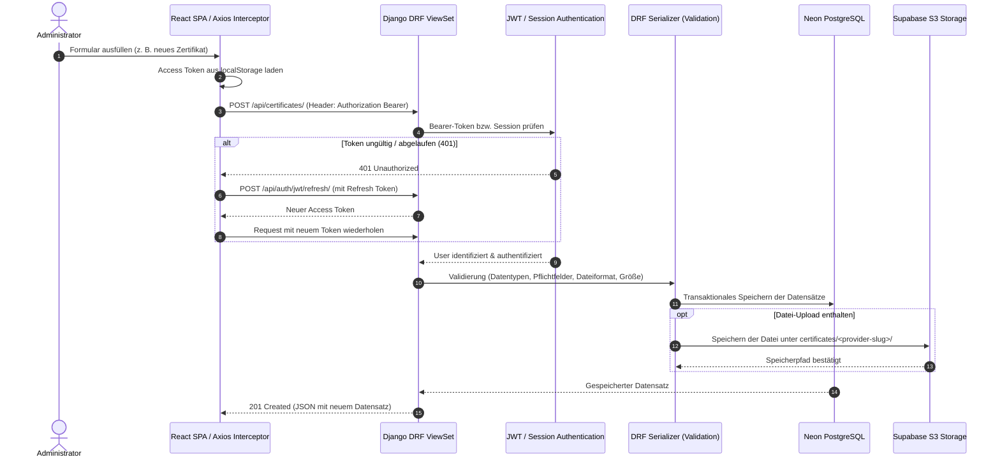

# System- und Architektur-Dokumentation

Diese Dokumentation beschreibt die Architektur, den Datenfluss, sämtliche API-Endpunkte sowie das Authentifizierungs- und Sicherheitskonzept des Portfolios.

---

## 1. Systemübersicht & Komponenten

Das Projekt ist als **Monorepo** organisiert und besteht aus einem **Django REST Framework (DRF)** Backend und einem **React TypeScript (Vite)** Frontend.

```mermaid
graph TB
    subgraph Clients["Clients & Benutzer"]
        Visitor["Portfolio-Besucher (Web)"]
        Admin["Administrator (Dashboard / Management)"]
    end

    subgraph CDN_Proxy["Edge & Hosting"]
        Render["Render Web Service (Reverse Proxy / Gunicorn)"]
        WhiteNoise["WhiteNoise (Static Assets)"]
    end

    subgraph Backend["Django 5.2 Application"]
        CoreUrls["URL Routing (core/urls.py)"]
        AuthModule["Auth & Security (Djoser + SimpleJWT + Sessions)"]
        ViewSets["DRF ViewSets (portfolio/views.py)"]
        DashboardView["Server-Rendered Views (Dashboard & Login)"]
        Models["Django ORM Models (portfolio/models.py)"]
    end

    subgraph Frontend["React Frontend (SPA)"]
        ReactApp["React / Vite App"]
        ApiClient["Axios API-Client (JWT & Interceptors)"]
    end

    subgraph Storage["Persistenz & Cloud Storage"]
        NeonDB[("Neon PostgreSQL (Produktion) / SQLite (Lokal)")]
        SupabaseS3[("Supabase Storage (S3-kompatibel)")]
    end

    Visitor -->|HTTP GET| Render
    Admin -->|Browser / SPA| Render
    ReactApp --> ApiClient
    ApiClient -->|REST API Requests| Render

    Render --> WhiteNoise
    Render --> CoreUrls

    CoreUrls --> AuthModule
    CoreUrls --> ViewSets
    CoreUrls --> DashboardView

    ViewSets --> Models
    DashboardView --> Models

    Models -->|SQL Queries| NeonDB
    Models -->|Media Files (Boto3)| SupabaseS3
```

### Kerntechnologien

| Schicht / Bereich | Technologie / Service | Zweck |
|---|---|---|
| **Backend-Framework** | Python 3.13 / Django 5.2 / DRF | REST-API, Geschäftslogik und Admin-Dashboard |
| **Paketmanagement** | `uv` (Astral) | Schnelle und reproduzierbare Abhängigkeitsverwaltung |
| **Frontend** | React 18 / TypeScript / Vite / Tailwind CSS | Öffentliche Portfolio-Webseite & SPA-Dashboard |
| **Primärdatenbank** | Neon Serverless PostgreSQL (Prod) / SQLite (Dev) | Speicherung aller relationalen Entitäten |
| **Dateispeicher (Media)** | Supabase Storage (S3-kompatible Boto3-Anbindung) | Zertifikatsdokumente (`.pdf`, `.png`, `.jpg`) |
| **Statische Dateien** | WhiteNoise (`CompressedManifestStaticFilesStorage`) | Auslieferung von CSS/JS direkt über Django |
| **Hosting & Deployment** | Render | Automatisierter Build via `build.sh` |

---

## 2. Datenfluss (Data Flow)

### 2.1 Öffentliche Leseanfragen (Portfolio-Besucher)

Öffentliche Besucher der Webseite greifen lesend auf Portfolio-Inhalte zu (Projekte, Zertifikate, Skills, Timeline). Dieser Flow ist zustandslos und erfordert keinen Login.



---

### 2.2 Administrativer Schreibzugriff (CRUD-Operationen)

Schreibzugriffe (Erstellen, Aktualisieren, Löschen von Projekten, Zertifikaten, Providern oder Skills) sind strikt geschützt und setzen eine Authentifizierung voraus.



---

### 2.3 Datei-Upload & Media-Handling (Supabase S3)

Zertifikatsdateien werden nicht im lokalen Dateisystem des Containers abgelegt, sondern persistent in einem S3-kompatiblen Bucket bei Supabase gespeichert.

1. **Client-Upload**: Multipart-Formularübertragung via `POST /api/certificates/`.
2. **Validierung auf Model-Ebene**:
   - `validate_file_extension`: Nur `.pdf`, `.png`, `.jpg` zulässig.
   - `validate_file_size`: Maximale Dateigröße von 5 MB.
3. **Dynamische Pfadgenerierung (`certificate_upload_path`)**:
   - Struktur: `certificates/<slugified-provider>/<filename>`.
   - Sonderfall-Handling: Liefert `slugify` für den Anbieternamen einen leeren String (z. B. bei reinen Sonderzeichen `"??? ***"`), greift automatisch der Fallback `"unsorted"`.
4. **S3-Speicherung**:
   - Supabase erfordert Pfad-basierte Adressierung (`AWS_S3_ADDRESSING_STYLE = "path"`) und Signatur-Version 4 (`AWS_S3_SIGNATURE_VERSION = "s3v4"`).
   - `AWS_QUERYSTRING_AUTH = False`: Zertifikate erhalten permanente, öffentliche URLs ohne ablaufende Signatur-Tokens.
   - `AWS_S3_FILE_OVERWRITE = False`: Verhindert versehentliches Überschreiben gleichnamiger Dateien durch automatische Anhängung von Hashes.

---

### 2.4 Datenbank-Routing & Umgebungsumschaltung

Die Wahl der Datenbank erfolgt implizit über das Vorhandensein der Umgebungsvariable `DATABASE_URL`:
- **Produktion**: Ist `DATABASE_URL` gesetzt, verbindet sich Django mit der **Neon PostgreSQL** Datenbank (`conn_max_age=600`, `ssl_require=True`).
- **Lokale Entwicklung**: Fehlt `DATABASE_URL`, greift Django automatisch auf die lokale Datei `db.sqlite3` zurück.
- **Test-Suite**: Tests nutzen `core.settings_test` via `pytest.ini` und laufen isoliert in einer temporären SQLite-In-Memory/Dateidatenbank.

---

## 3. API-Endpunkte

### 3.1 REST-API (`/api/`)

Registriert über den `DefaultRouter` in [core/urls.py](file:///d:/dev/portfolio_project/core/urls.py). Alle ViewSets verwenden die Berechtigungsklasse `IsAuthenticatedOrReadOnly`.

| Endpunkt | HTTP-Methoden | Berechtigung | Beschreibung |
|---|---|---|---|
| `/api/projects/` | `GET`, `POST` | Read: Öffentlich<br>Write: Auth | Liste aller Portfolio-Projekte abrufen oder neues Projekt anlegen. |
| `/api/projects/<id>/` | `GET`, `PUT`, `PATCH`, `DELETE` | Read: Öffentlich<br>Write: Auth | Detailansicht, Aktualisierung oder Löschung eines Projekts. |
| `/api/certificates/` | `GET`, `POST` | Read: Öffentlich<br>Write: Auth | Zertifikate auflisten oder neues Zertifikat (Multipart) hochladen. |
| `/api/certificates/<id>/` | `GET`, `PUT`, `PATCH`, `DELETE` | Read: Öffentlich<br>Write: Auth | Detailansicht, Aktualisierung oder Löschung eines Zertifikats. |
| `/api/providers/` | `GET`, `POST` | Read: Öffentlich<br>Write: Auth | Zertifikatsanbieter (z. B. AWS, Coursera, Udemy) auflisten/anlegen. |
| `/api/providers/<id>/` | `GET`, `PUT`, `PATCH`, `DELETE` | Read: Öffentlich<br>Write: Auth | Detailansicht, Aktualisierung oder Löschung eines Anbieters. |
| `/api/skills/` | `GET`, `POST` | Read: Öffentlich<br>Write: Auth | Fähigkeiten/Technologien auflisten oder anlegen. |
| `/api/skills/<id>/` | `GET`, `PUT`, `PATCH`, `DELETE` | Read: Öffentlich<br>Write: Auth | Detailansicht, Aktualisierung oder Löschung eines Skills. |
| `/api/timeline/` | `GET`, `POST` | Read: Öffentlich<br>Write: Auth | Werdegang- / Timeline-Einträge abrufen oder erstellen. |
| `/api/timeline/<id>/` | `GET`, `PUT`, `PATCH`, `DELETE` | Read: Öffentlich<br>Write: Auth | Einzelnen Timeline-Eintrag verwalten. |

---

### 3.2 Das Hybrid-Serializer-Pattern

Um dem Frontend maximale Effizienz beim Lesen und Einfachheit beim Schreiben zu bieten, implementieren alle DRF-Serializer das **Hybrid-Pattern**:

- **Leseanfragen (`GET`)**: Enthalten serialisierte, verschachtelte Detailobjekte (`skill_details`, `provider_details`). Dadurch entfallen zusätzliche API-Calls für verknüpfte Ressourcen (z. B. Anbieter-Metadaten oder Skill-Icons).
- **Schreibanfragen (`POST`, `PUT`, `PATCH`)**: Erwarten flache Primärschlüssel-IDs (`skills: [1, 2]`, `provider: 3`). Dies vereinfacht Formular-Payloads und reduziert Overhead.
- **Tuple-Deklaration**: Alle `Meta.fields` sind als unveränderliche Tuples deklariert (Ruff-Regel `RUF012`).

---

### 3.3 Auth-API (`/api/auth/` via Djoser & SimpleJWT)

Eingebunden in [core/urls.py](file:///d:/dev/portfolio_project/core/urls.py) über `djoser.urls` und `djoser.urls.jwt`.

| Endpunkt | HTTP-Methode | Berechtigung | Beschreibung |
|---|---|---|---|
| `/api/auth/jwt/create/` | `POST` | `AllowAny` | Login mit `email` & `password`. Gibt `access` (60 Min.) und `refresh` (7 Tage) Token zurück. |
| `/api/auth/jwt/refresh/` | `POST` | `AllowAny` | Erneuert einen abgelaufenen Access Token mittels Refresh Token. |
| `/api/auth/jwt/verify/` | `POST` | `AllowAny` | Prüft, ob ein übergebener Token noch gültig ist. |
| `/api/auth/users/me/` | `GET` | `IsAuthenticated` | Gibt das Benutzerprofil des aktuell eingeloggten Users zurück. |
| `/api/auth/users/reset_password/` | `POST` | `AllowAny` | Sendet bei Bedarf eine E-Mail zum Zurücksetzen des Passworts. |
| `/api/auth/users/reset_password_confirm/` | `POST` | `AllowAny` | Bestätigt ein neues Passwort anhand des empfangenen Tokens. |

> [!IMPORTANT]
> **Gesperrte Endpunkte**: Der Endpunkt `POST /api/auth/users/` (Registrierung) sowie die Endpunkte zur Änderung des Benutzernamens (`username_update`) und Kontolöschung (`user_delete`) sind über Djoser-Berechtigungen strikt auf `IsAdminUser` beschränkt. Eine Selbstregistrierung durch Dritte ist unmöglich.

---

### 3.4 Web- und Dashboard-Views

Zusätzlich zur JSON-REST-API stellt Django Server-Rendered-Views für das interne Administrations-Dashboard bereit:

| Endpunkt | Methode | Schutz | Beschreibung |
|---|---|---|---|
| `/` | `GET`, `POST` | Öffentlich / `@csrf_exempt` | Login-Seite (`login.html`). Bei bestehender Session erfolgt Redirect auf `/dashboard/`. POST verifiziert Credentials und setzt Session-Cookie. |
| `/dashboard/` | `GET` | `@login_required(login_url="/")` | Geschütztes Vanilla CSS/JS Portfolio-Dashboard (`dashboard.html`) zur Pflege der Daten. |
| `/logout/` | `GET` | Authentifiziert | Meldet die Session ab und leitet auf `/` weiter. |
| `/health_check`, `/health_check/` | `GET` | Öffentlich | Liefert `{"status": "ok"}` für Render-Uptime-Checks und Monitoring. |

---

### 3.5 API-Dokumentation & OpenAPI-Schema

Die API ist über `drf-spectacular` vollständig nach OpenAPI 3.0 spezifiziert:
- Schema-Generierung erfolgt automatisch basierend auf Serializern, ViewSets und Typ-Annotationen.
- Sicherheitsdefinitionen weisen `Bearer` (JWT) als Authentifizierungsmechanismus aus.

---

## 4. Authentifizierungs-Entscheidung & Sicherheitskonzept

### 4.1 Dual-Auth-Strategie: Rationale

Das Portfolio-Projekt nutzt eine bewusste **Dual-Auth-Architektur**, um zwei verschiedene Client-Typen optimal und sicher zu bedienen:

```text
                               ┌────────────────────────────────────────────────────────┐
                               │                 Dual-Auth-Architektur                  │
                               └────────────────────────────────────────────────────────┘
                                              │
                      ┌───────────────────────┴───────────────────────┐
                      ▼                                               ▼
       ┌──────────────────────────────┐                ┌──────────────────────────────┐
       │   Session-Authentifizierung  │                │      JWT-Authentifizierung   │
       │   (Django Web Dashboard)     │                │      (React SPA Frontend)    │
       ├──────────────────────────────┤                ├──────────────────────────────┤
       │ • Server-Side Rendering      │                │ • Headless REST-API          │
       │ • HttpOnly Session-Cookie    │                │ • Stateless Bearer Token     │
       │ • Eingebauter CSRF-Schutz    │                │ • Axios Request/Refresh-Flow │
       │ • Kein Token-Storage im JS   │                │ • Entkoppeltes Frontend      │
       └──────────────────────────────┘                └──────────────────────────────┘
```

1. **Session-Authentifizierung (für das integrierte Django-Dashboard)**:
   - **Vorteil**: Die Authentifizierung erfolgt über browserverwaltete `sessionid`-Cookies mit `HttpOnly`-Flag. JavaScript hat keinen Zugriff auf das Cookie, was XSS-Token-Diebstahl verhindert.
   - **Einsatzbereich**: Schnelle administrative Bearbeitungen direkt über das Server-Dashboard (`/dashboard/`).

2. **JWT-Authentifizierung via SimpleJWT & Djoser (für das React SPA Frontend)**:
   - **Vorteil**: Vollkommen zustandslos (stateless) auf dem Server. Die React-App kann auf einer beliebigen Domain oder CDN gehostet werden und autorisiert Anfragen via `Authorization: Bearer <access_token>`.
   - **Token-Lifecycle**:
     - **Access Token (60 Minuten)**: Kurzlebig, autorisiert jede Anfrage.
     - **Refresh Token (7 Tage)**: Wird im Frontend genutzt, um bei Ablauf des Access Tokens (HTTP 401) transparent im Hintergrund einen neuen Access Token abzurufen (Axios Response Interceptor in `frontend/src/api/client.ts`).

---

### 4.2 Sicherheitsentscheidungen & Systemhärtung

#### 1. Vollständige Deaktivierung des Standard-Django-Admins (`/admin/`)
- Das Standard-Admin-Interface `/admin/` wurde aus [core/urls.py](file:///d:/dev/portfolio_project/core/urls.py) entfernt.
- **Begründung**: Reduzierung der Angriffsfläche gegen automatisierte Bots und Brute-Force-Attacken auf Standard-Django-Login-Pfade. Sämtliche Administration erfolgt über das maßgeschneiderte Dashboard bzw. die REST-API.

#### 2. Custom User Model mit E-Mail-Zwang
- Definition in [portfolio/models.py](file:///d:/dev/portfolio_project/portfolio/models.py) als `portfolio.User`.
- `LOGIN_FIELD = "email"`, kein `username`-Feld vorhanden.
- **Begründung**: Moderne, verwechslungsfreie Identifizierung. Passwörter werden standardmäßig mit PBKDF2-SHA256 gehasht (in Tests mit schnellem MD5-Hasher für maximale Geschwindigkeit).

#### 3. Strikt geschlossenes Registrierungssystem
- Neue Benutzer können ausschließlich manuell über die Konsole per `uv run python manage.py createsuperuser` angelegt werden.
- Djoser-Endpunkte für Registrierung (`user_create`), Username-Updates und Kontolöschung sind auf `IsAdminUser` beschränkt.
- **Begründung**: Ein persönliches Portfolio benötigt keine öffentliche Benutzerregistrierung.

#### 4. Schutz vor Datenverlust bei Zertifikatsanbietern
- `Certificate.provider` ist als `ForeignKey(Provider, on_delete=models.PROTECT)` definiert.
- **Begründung**: Ein Anbieter kann nicht versehentlich gelöscht werden, solange ihm noch Zertifikate zugeordnet sind.

#### 5. Produktionssicherheit (`DEBUG=False`)
- Sobald `DEBUG=False` aktiv ist, greifen folgende Härtungsmaßnahmen:
  - `SECURE_SSL_REDIRECT = True`: Erzwungenes HTTPS.
  - `SECURE_HSTS_SECONDS = 31536000` (1 Jahr) mit `SECURE_HSTS_INCLUDE_SUBDOMAINS = True`.
  - `SECURE_HSTS_PRELOAD = False` (bewusst deaktiviert gemäß Richtlinien).
  - Sichere Cookies (`SESSION_COOKIE_SECURE = True`, `CSRF_COOKIE_SECURE = True`).

---

## 5. Wartung & Entwicklungsrichtlinien

Für Code-Änderungen an Modellen, APIs oder der Konfiguration gelten die verbindlichen Vorgaben aus [AGENTS.md](file:///d:/dev/portfolio_project/AGENTS.md) und [GEMINI.md](file:///d:/dev/portfolio_project/GEMINI.md):

- **Modell-Änderungen**: Stets Migrationen erzeugen (`uv run python manage.py makemigrations`) und committete Migrationen niemals nachträglich modifizieren.
- **Qualitätssicherung**: Vor jedem Merge müssen alle Prüfungen bestehen:
  ```bash
  # Test-Suite mit Coverage-Check (>= 95%)
  uv run pytest --cov=portfolio --cov-fail-under=95

  # Linting & Formatierung
  uv run ruff check .
  uv run ruff format .

  # Typ-Sicherheit
  uv run mypy .
  ```
