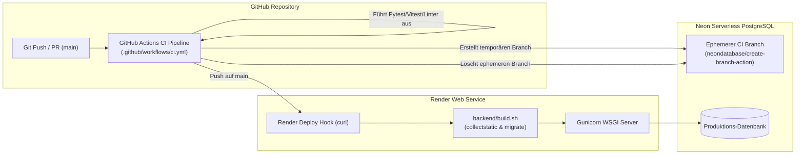

# Deployment & Operations Leitfaden

Dieses Dokument beschreibt den Deployment-Prozess auf Render, die CI/CD-Pipeline in GitHub Actions sowie die Konfiguration von Neon Serverless PostgreSQL.

---

## 1. Systemübersicht Deployment



---

## 2. Render Web Service Konfiguration

### 2.1 Konfiguration (`render.yaml`)
Der Backend-Service ist als Web-Service mit Python-Environment deklariert:
```yaml
services:
  - type: web
    name: portfolio-backend
    env: python
    rootDir: backend
    buildCommand: bash build.sh
    startCommand: uv run gunicorn core.wsgi:application
    healthCheckPath: /health_check
```

### 2.2 Ausführungskontext von `build.sh`
Da Render `rootDir: backend` nutzt, liegt das Skript ausschließlich unter [`backend/build.sh`](file:///d:/dev/portfolio_project/backend/build.sh) (kein Duplikat im Root). Es wird über `bash build.sh` aufgerufen, damit kein Executable-Bit nötig ist; `.gitattributes` erzwingt LF-Zeilenenden für `*.sh`:

```bash
#!/usr/bin/env bash
set -o errexit

uv sync --frozen --no-dev
uv run python manage.py collectstatic --noinput
uv run python manage.py migrate --noinput
```

---

## 3. GitHub Actions CI/CD Pipeline

Die Pipeline ist in [`.github/workflows/ci.yml`](file:///d:/dev/portfolio_project/.github/workflows/ci.yml) definiert und umfasst 4 Jobs:

1. **`backend-lint-test`**:
   - Startet ephemeren Neon DB-Branch via `neondatabase/create-branch-action@v5`.
   - Führt Ruff, Mypy und Pytest mit Coverage ($\ge 95\%$) aus.
   - Bereinigt den Neon-Branch nach Testende (`always()`).
2. **`frontend-lint-test`**:
   - Führt `npm ci`, Oxlint, Vitest und `npm run build` aus.
3. **`backend-build`**:
   - Validiert, dass Python 3.13 und Abhängigkeiten mit `uv` fehlerfrei auflösen.
   - Führt `python manage.py check` und `python manage.py collectstatic` im Produktionsmodus (`DEBUG=False`) durch.
   - **Wichtig**: Benötigt `defaults: run: working-directory: backend`.
4. **`deploy`**:
   - Triggert bei erfolgreichem Push auf `main` den Render Deploy Hook via `curl`.

---

## 4. Benötigte Secrets & Umgebungsvariablen

| Variable | Scope | Zweck |
|---|---|---|
| `NEON_PROJECT_ID` | GitHub Actions Secret | ID des Neon-Projekts für ephemere Test-Branches |
| `NEON_API_KEY` | GitHub Actions Secret | API-Key für Neon Management CLI (`neonctl`) |
| `RENDER_DEPLOY_HOOK_URL` | GitHub Actions Secret | Webhook-URL zum Starten des Render-Deployments |
| `DATABASE_URL` | Render Environment | Connection-String zur Neon-Produktionsdatenbank |
| `SECRET_KEY` | Render Environment | Django Secret Key |
| `SUPABASE_URL` & Keys | Render Environment | S3-kompatibler Medien-Speicher für Zertifikate |
