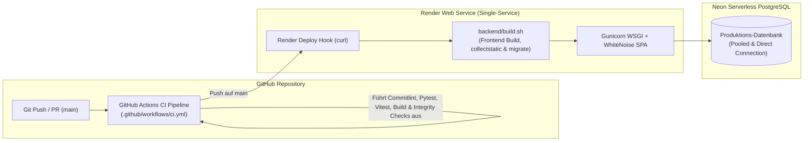

# Deployment & Operations Leitfaden

Dieses Dokument beschreibt den Deployment-Prozess auf Render (Single-Service: Django 6.0 / >=5.2 Headless REST API & integrierte React 19 SPA Auslieferung über WhiteNoise), die CI/CD-Pipeline in GitHub Actions sowie die Konfiguration von Neon Serverless PostgreSQL.

---

## 1. Systemübersicht Deployment


```mermaid
flowchart LR
    subgraph GitHub["GitHub Repository"]
        Commit["Git Push / PR (main)"]
        CI["GitHub Actions CI Pipeline<br>(.github/workflows/ci.yml)"]
    end

    subgraph Neon["Neon Serverless PostgreSQL"]
        ProdDB[("Produktions-Datenbank<br>(Pooled & Direct Connection)")]
    end

    subgraph Render["Render Web Service (Single-Service)"]
        DeployHook["Render Deploy Hook (curl)"]
        BuildHook["backend/build.sh<br>(Frontend Build, collectstatic & migrate)"]
        Gunicorn["Gunicorn WSGI + WhiteNoise SPA"]
    end

    Commit --> CI
    CI -->|Führt Commitlint, Pytest, Vitest, Build & Integrity Checks aus| CI
    CI -->|Push auf main| DeployHook
    DeployHook --> BuildHook
    BuildHook --> Gunicorn
    Gunicorn --> ProdDB
```

---

## 2. Render Web Service Konfiguration

### 2.1 Konfiguration (`render.yaml`)
Das Projekt wird über ein deklaratives Render Blueprint als integrierter **Single-Service** verwaltet, bei dem Django und WhiteNoise sowohl die REST-API als auch das gebaute React-Frontend (`frontend/dist`) ausliefern:
```yaml
services:
  - type: web
    name: portfolio-backend
    env: python
    autoDeployTrigger: off
    rootDir: backend
    buildCommand: "./build.sh"
    startCommand: "uv run gunicorn core.wsgi:application --bind 0.0.0.0:$PORT --workers 2 --threads 4"
    healthCheckPath: /health_check
```

### 2.2 Ausführungskontext von `build.sh`
Das primäre Build-Skript liegt unter [`backend/build.sh`](../backend/build.sh). Zusätzlich existiert im Projekt-Root ein resilientes Fallback-Skript [`build.sh`](../build.sh), falls der Service im Render Dashboard ohne konfiguriertes `rootDir` (d. h. im Repository-Root) gestartet wird. Es wechselt automatisch in `backend/` und führt das Backend-Build-Skript aus:

```bash
#!/usr/bin/env bash
set -euo pipefail

uv sync --frozen --no-dev
uv run python manage.py check
(cd ../frontend && npm ci --include=optional && npm run build)
uv run python manage.py collectstatic --noinput

# Für Schema-Migrationen DIRECT_DATABASE_URL priorisieren (PgBouncer-Bypass)
if [ -n "${DIRECT_DATABASE_URL:-}" ]; then
    RUNNING_MIGRATION=1 uv run python manage.py migrate --noinput
else
    uv run python manage.py migrate --noinput
fi

uv run python manage.py index_rag_chunks
```

### 2.3 Neon PostgreSQL: Trennung von Pooled- und Direct-Connection
Neon Serverless PostgreSQL bietet zwei Verbindungstypen mit spezifischen Anwendungsfällen:

- **Gepoolte Verbindung (`DATABASE_URL`):**
  - Host enthält `-pooler` (z. B. `ep-xyz-pooler.eu-central-1.aws.neon.tech`).
  - Nutzt PgBouncer im Transaction-Pooling-Modus.
  - **Einsatz:** Regulärer Web-Betrieb (Gunicorn-Worker), um Tausende gleichzeitiger Requests effizient abzufedern und Verbindungsressourcen zu schonen.
- **Direkte Verbindung (`DIRECT_DATABASE_URL`):**
  - Host ohne `-pooler` (z. B. `ep-xyz.eu-central-1.aws.neon.tech`).
  - Direkte Verbindung zur Neon-Compute-Instanz.
  - **Einsatz:** Schema-Migrationen (`python manage.py migrate`), `pg_dump`, `pg_restore` und DDL-Operationen, da PgBouncer Session-Status, Prepared Statements und DDL-Sperren blockieren kann.

In `core/settings.py` prüft Django automatisch, ob ein Migrationsbefehl aktiv ist (`migrate`, `makemigrations`, `RUNNING_MIGRATION=1`), und priorisiert in diesem Fall `DIRECT_DATABASE_URL` mit `conn_max_age=0`.

---

## 3. GitHub Actions CI/CD Pipeline

Die Pipeline ist in [`.github/workflows/ci.yml`](../.github/workflows/ci.yml) definiert, nutzt eine `concurrency`-Gruppe (`cancel-in-progress: true`) zur Vermeidung überlappender Läufe und umfasst folgende Jobs:

1. **`commitlint` (Conventional Commits Linter)**:
   - Prüft alle Commits eines Pushes oder Pull Requests mit `wagoid/commitlint-github-action@v6` gegen die Regeln in [`.commitlintrc.json`](../.commitlintrc.json).
2. **`backend-ci` (Python, Lint, Types, Docs & Pytest)**:
   - Richtet Python 3.13 und `uv` mit Dependency-Caching (`backend/uv.lock`) ein.
   - Führt Ruff Linter (`ruff check .`), Ruff Formatter Check (`ruff format --check .`), Mypy (`mypy .`) sowie die Dokumentations-Integritätsprüfung (`scripts/verify_markdown_integrity.py`) aus.
   - Führt die Backend-Testsuite (`pytest --cov=core --cov=portfolio --cov-fail-under=95`, 314+ Tests) aus und lädt JUnit- sowie Cobertura-XML-Testberichte als Artefakte hoch.
3. **`frontend-ci` (TypeScript, Lint, Vitest & Build)**:
   - Führt auf Node.js 22 LTS `npm ci`, Oxlint (`npm run lint`), Vitest (117 Tests in 22 Dateien) und `npm run build` aus.
   - Stellt das kompilierte `frontend/dist/`-Verzeichnis als Artefakt (`frontend-dist`) für die nachfolgende Backend-Build-Verifikation bereit.
4. **`backend-build` (Produktions-Artefakt-Verifikation)**:
   - Lädt das gebaute `frontend/dist/`-Artefakt und installiert die reinen Produktionsabhängigkeiten (`uv sync --frozen --no-dev`).
   - Führt `python manage.py check --deploy`, `python manage.py makemigrations --check --dry-run` und `python manage.py collectstatic --noinput` im Produktionsmodus (`DEBUG=False`) durch.
   - **Wichtig**: Nutzt `defaults: run: working-directory: backend`.
5. **`deploy` (Zero-Downtime Server-Deployment)**:
   - Läuft nur bei erfolgreichem Push auf `main` nach bestandenem `backend-build`.
   - Triggert den Render Deploy Hook (`RENDER_DEPLOY_HOOK_URL`) via `curl` mit automatischer Retry-Logik.
   - In [`render.yaml`](../render.yaml) sind `autoDeployTrigger: off` und `buildFilter` (ignoriert `*.md`, `docs/**`) hinterlegt, sodass Render nicht bei jedem Git-Push unkoordiniert neu baut, sondern strikt dem GitHub Actions Freigabe-Signal folgt.

### 3.1 Code Ownership & PR-Governance (`.github/CODEOWNERS`)
Über [`.github/CODEOWNERS`](../.github/CODEOWNERS) sind kritische Pfade im Repository explizit geschützt (`@dfluechter` bzw. erweiterbar auf GitHub-Teams wie `@org/devops` oder `@org/security`):
- **CI/CD & Deployment:** `/.github/workflows/`, `/render.yaml`, `/build.sh`, `/backend/build.sh`
- **Backend Security & Schema:** `/backend/core/settings.py`, `/backend/portfolio/migrations/`, `/backend/portfolio/services/`, `/backend/pyproject.toml`
- **Frontend Auth & Build:** `/frontend/src/api/`, `/frontend/src/context/`, `/frontend/vite.config.ts`
- **Governance & Schutzregeln:** `/AGENTS.md`, `/.agents/`, `/docs/adrs/`

In Kombination mit der GitHub Branch-Protection-Regel *"Require review from Code Owners"* auf `main` erzwingt dies automatische Review-Zuweisungen bei Pull Requests auf kritischen Infrastruktur- und Sicherheitspfaden.

### 3.2 Automatisierte Qualitätssicherung durch Git-Hooks und Commitlint

Lokale Git-Hooks fungieren als erste Verteidigungslinie. Mithilfe von Werkzeugen wie *Husky* wird der `commit-msg`-Hook genutzt, um Formatierungs- und Syntaxfehler im Vorfeld zu verhindern.

Die Validierung der Commit-Nachrichten folgt der *Conventional Commits*-Spezifikation:
```text
<type>(<scope>): <description>

[optional body]

[optional footer(s)]
```

#### Zulässige Commit-Typen ([`.commitlintrc.json`](../.commitlintrc.json)):

* `build`: Änderungen an Build-Systemen, CI-Pipelines oder Abhängigkeiten.
* `chore`: Administrative Aufgaben, die keinen Anwendungscode betreffen.
* `enh`: Verbesserungen bestehender Funktionalitäten.
* `docs`: Reine Dokumentationsänderungen.
* `feat`: Einführung neuer Funktionen.
* `fix`: Behebung von Softwarefehlern.
* `perf`: Performance-Optimierungen.
* `refactor`: Code-Umstrukturierungen ohne Funktionsänderung oder Bugfix.
* `revert`: Rücknahme vorheriger Commits.
* `style`: Formatierungen, fehlende Semikolons, Reformatierung von Whitespaces.
* `test`: Ergänzung oder Korrektur von automatisierten Tests.

#### Formale Regeln für Commit-Nachrichten:

* **Verwendung des Imperativs im Präsens:** z. B. `change` statt `changed` oder `changes`.
* **Kleinschreibung des Subjects:** `subject-case` ist strikt `lower-case`.
* **Kein Punkt (`.`) am Ende des Headers:** Verhindert Satzzeichen im Einzeiler.
* **Maximale Header-Länge:** 72 Zeichen (`header-max-length`).
* **Konfigurierte Casing-Regeln:** Der Scope unterstützt `camelCase`, `kebab-case` (z. B. für Dependabot `deps-backend`, `deps-frontend`) und `lower-case` (`scope-case`), das Subject ist strikt in Kleinschreibung (`lower-case`).
* **Optionaler Footer:** Kennzeichnung von Breaking Changes mit `BREAKING CHANGE:`, Angabe von Ticket-Referenzen (z. B. `refers to JIRA-1337`) oder Co-Autoren (`Co-authored-by:`).

#### Lokale Ausführung via Husky ([`.husky/commit-msg`](../.husky/commit-msg))
Bei jedem Aufruf von `git commit` wird der Hook vor dem eigentlichen Commit ausgeführt:
```bash
#!/usr/bin/env sh
npx --no -- commitlint --edit "$1"
```
Verstößt eine Commit-Nachricht gegen die Konvention (z. B. Großschreibung im Subject, falscher Scope-Casing oder ungültiger Typ), wird der Commit lokal mit einer präzisen Fehlermeldung abgelehnt, bevor er in den Git-Verlauf gelangt.

#### Synergie mit Render `buildFilter`
Die strikte Trennung von Dokumentations- und Code-Commits harmoniert mit dem `buildFilter` in [`render.yaml`](../render.yaml):
- Reine Änderungen an `docs/**` oder `README.md` werden vom Render-Build-Filter ignoriert.
- Code-Commits in `backend/**` und `frontend/**` durchlaufen den vollständigen Test- und Deployment-Zyklus.

---

## 4. Benötigte Secrets & Umgebungsvariablen

| Variable | Scope | Zweck |
|---|---|---|
| `RENDER_DEPLOY_HOOK_URL` | GitHub Actions Secret | Webhook-URL zum Starten des Render-Deployments |
| `DATABASE_URL` | Render Environment | Gepoolter Connection-String (`-pooler`) für Gunicorn |
| `DIRECT_DATABASE_URL` | Render Environment | Direkter Connection-String (ohne `-pooler`) für Schema-Migrationen |
| `SECRET_KEY` | Render Environment | Django Secret Key |
| `DJANGO_ALLOWED_HOSTS` | Render Environment | Kommagetrennte Liste erlaubter Hostnamen (`dfluechter.ipv64.de,dfluechter.onrender.com,...`) |
| `CORS_ALLOWED_ORIGINS` | Render Environment | Erlaubte CORS-Origins (`https://dfluechter.ipv64.de,https://dfluechter.onrender.com`) |
| `CSRF_TRUSTED_ORIGINS` | Render Environment | Vertrauenswürdige CSRF-Origins (`https://dfluechter.ipv64.de,https://dfluechter.onrender.com`) |
| `USE_SUPABASE_S3` | Render Environment | `True` aktiviert den S3-Storage via `django-storages` |
| `AWS_ACCESS_KEY_ID` | Render Environment | Supabase S3 Access Key ID |
| `AWS_SECRET_ACCESS_KEY` | Render Environment | Supabase S3 Secret Access Key |
| `AWS_STORAGE_BUCKET_NAME` | Render Environment | Name des Supabase Storage Buckets (z. B. `portfolio-media`) |
| `AWS_S3_ENDPOINT_URL` | Render Environment | S3-Endpunkt (`https://<project-ref>.supabase.co/storage/v1/s3`) |
| `AWS_S3_REGION_NAME` | Render Environment | Region (z. B. `eu-central-1`) |
| `AWS_S3_PUBLIC_BUCKET` | Render Environment | `True` für dauerhafte Direkt-URLs, `False` für signierte URLs |
| `SUPABASE_PUBLIC_MEDIA_URL` | Render Environment | Öffentliche CDN-Basis-URL des Buckets |
| `GEMINI_API_KEY` | Render Environment | API-Key für Google Gemini (RAG Portfolio-Copilot & multimodale OCR) |
| `GEMINI_MODEL` | Render Environment | Konfiguriertes Gemini-Modell (Standard: `gemini-2.5-flash`) |
| `GEMINI_EMBEDDING_MODEL` | Render Environment | Konfiguriertes Embedding-Modell (Standard: `gemini-embedding-001`) |
| `GEMINI_DAILY_TOKEN_LIMIT` | Render Environment | Tägliches Token-Budget für den Zero-Cost Circuit-Breaker (`50000`) |
| `GEMINI_DAILY_REQUEST_LIMIT` | Render Environment | Tägliches Request-Limit für KI-Aufrufe (`100`) |

---

## 5. Supabase Storage: CORS-Konfiguration für Direct-to-Storage Uploads

Da der Browser beim Direct-to-Storage Upload (User Story 10.1) Binärdateien direkt per `HTTP PUT` an den Supabase-S3-Endpunkt sendet, muss im Supabase-Projekt eine CORS-Regel für den Bucket hinterlegt sein:

```json
[
  {
    "AllowedOrigins": [
      "https://dfluechter.ipv64.de",
      "https://dfluechter.onrender.com",
      "http://localhost:3000",
      "http://localhost:5173"
    ],
    "AllowedMethods": ["GET", "PUT", "HEAD"],
    "AllowedHeaders": ["*"],
    "ExposeHeaders": ["ETag"],
    "MaxAgeSeconds": 3600
  }
]
```

Diese Konfiguration kann über das Supabase Dashboard (Storage $\rightarrow$ Bucket Configuration $\rightarrow$ CORS Policies) oder über die AWS/S3-kompatible API hinterlegt werden.

---

## 6. Lokales OCR-Setup (Tesseract & PDF-Rendering)

Für die lokale Stufe-2-OCR-Extraktion von gescannten Zertifikaten (`.png`, `.jpg` sowie bildbasierte PDFs) wird **Tesseract OCR** inklusive deutschem Sprachpaket (`deu`) benötigt:

1. **Installation unter Windows (`winget`):**

   ```powershell
   winget install --id UB-Mannheim.TesseractOCR -e
   ```

   Im Setup unter *Additional language data* das Paket **German (`deu`)** auswählen (alternativ `deu.traineddata` nach `C:\Program Files\Tesseract-OCR\tessdata\` kopieren).

2. **Umgebungsvariablen (optional bei abweichendem Pfad):**

   ```env
   TESSERACT_CMD=C:\Program Files\Tesseract-OCR\tesseract.exe
   TESSDATA_PREFIX=C:\Program Files\Tesseract-OCR\tessdata
   ```

   Für bildbasierte PDFs ohne eingebetteten Textlayer wird bevorzugt `PyMuPDF` (`fitz`) oder alternativ Poppler (`pdftoppm`, konfigurierbar über `POPPLER_PATH`) genutzt.

3. **Health-Check & Read-Only-Evaluation:**

   ```powershell
   python manage.py check_ocr
   python manage.py evaluate_ocr --limit 25
   ```
