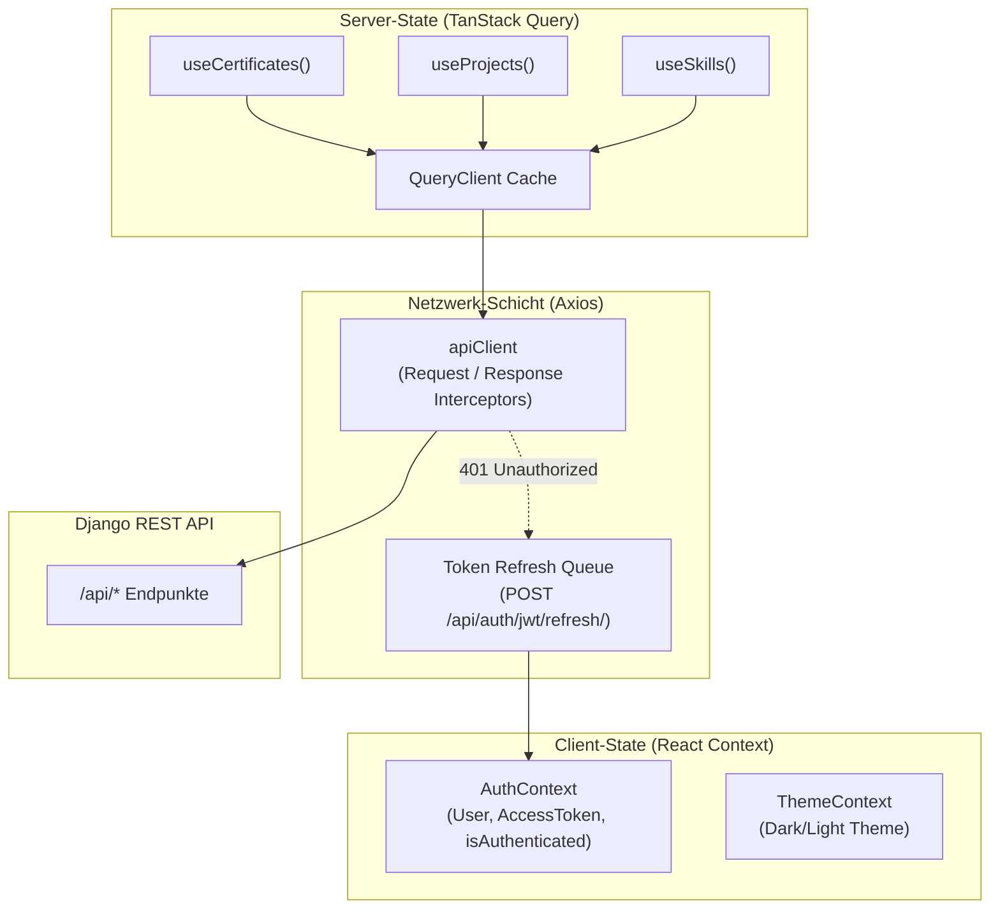

# Frontend Architektur & Dokumentation

Diese Dokumentation beschreibt die Architektur, den Komponentenaufbau, das State-Management und die Authentifizierungsmechanismen der React-SPA (`frontend/`).

---

## 1. Übersicht & Tech Stack

Das Frontend ist eine moderne Single Page Application (SPA), optimiert für Performance, Barrierefreiheit (a11y) und Typsicherheit.

| Technologie | Version / Tooling | Zweck |
|---|---|---|
| **Framework** | React 19 + TypeScript | UI-Komponenten und Typsicherheit |
| **Build-Tool** | Vite 8 | Schnellster Dev-Server & optimiertes Rollup-Bundling |
| **Styling** | Tailwind CSS v4 (`@tailwindcss/vite`) | Utility-first Designsystem ohne Build-Overhead |
| **Server-State** | TanStack Query v5 (`@tanstack/react-query`) | Asynchrones Caching, Hintergrund-Sync & Deduplizierung |
| **HTTP-Client** | Axios (`axios`) | Request-/Response-Interceptors & automatischer Token-Refresh |
| **Routing** | React Router v7 (`react-router-dom`) | Deklaratives Client-Side-Routing mit geschützten Dashboard-Routen |
| **Icons** | Lucide React | Einheitliche SVG-Icons |
| **Animationen** | Framer Motion | Sanfte Seitenübergänge und interaktive UI-Effekte |
| **Testing & Linting** | Vitest + React Testing Library + Oxlint | Schnelle Unit- und Integrationstests sowie ultraschnelles Linting |

---

## 2. Verzeichnisstruktur

```
frontend/src/
├── api/
│   ├── client.ts             # Axios Instanz mit JWT-Injektion & 401-Refresh-Queue
│   └── client.test.ts        # Tests für Interceptors und Queue-Verhalten
├── components/
│   ├── common/               # Wiederverwendbare UI-Elemente (Button, Modal, Input, Badge)
│   ├── dashboard/            # CRUD-Formulare & Tabellen für Zertifikate, Skills, Projekte
│   ├── ErrorBoundary.tsx     # Globaler React ErrorBoundary für Crash-Resilienz
│   └── Navbar.tsx / Footer.tsx # Layout-Komponenten
├── context/
│   ├── AuthContext.tsx       # Globaler Auth-Status (Token-Persistenz, Login/Logout)
│   └── ThemeContext.tsx      # Dark-/Light-Mode State
├── hooks/
│   ├── usePortfolio.ts       # TanStack Query Hooks (useCertificates, useProjects, useSkills, ...)
│   └── usePortfolioSearch.ts # Client-seitige Volltextsuche und Filterung
├── pages/
│   ├── Home.tsx              # Öffentliche Portfolio-Startseite
│   ├── Login.tsx             # JWT-Login für das Management-Interface
│   └── Dashboard.tsx         # Geschütztes Dashboard mit Rollen- und Session-Validierung
├── types/
│   └── index.ts              # TypeScript Schnittstellen (Certificate, Project, Skill, User)
├── App.tsx                   # React Router Konfiguration & Provider-Verschachtelung
└── main.tsx                  # Einstiegspunkt (QueryClientProvider, DOM Mounting)
```

---

## 3. State Management & Datenfluss

Gemäß [ADR-004](adrs/004-state-management-frontend.md) trennt die Anwendung strikt zwischen **Server-State** und **Client-State**:



### 3.1 Server-State mit TanStack Query (`usePortfolio.ts`)
- **Query Keys**: Strukturierte Keys zur gezielten Cache-Invalidierung (z. B. `['certificates']`, `['projects']`, `['skills']`).
- **Optimistische Updates**: Schreibende Mutationen invalidieren den entsprechenden Query-Key nach erfolgreichem Response (`queryClient.invalidateQueries({ queryKey: [...] })`).
- **Stale Time**: Standardmäßig auf sinnvolle Intervalle gesetzt, um unnötige Hintergrundabfragen auf statischen Portfolio-Daten zu minimieren.

### 3.2 Client-State mit React Context (`AuthContext.tsx`)
- Verwaltet die Authentifizierungsinformationen (`user`, `accessToken`, `refreshToken`).
- Hört auf das benutzerdefinierte Event `window.dispatchEvent(new Event('auth:unauthorized'))`.
- Sobald ein Token-Refresh scheitert oder ungültig wird, setzt der Context den Zustand zurück und leitet den Benutzer kontrolliert auf `/login` um.

---

## 4. API-Client & JWT Refresh-Zyklus (`client.ts`)

Der Axios-Client handhabt den gesamten Token-Lifecycle transparent:

1. **Request Interceptor**:
   - Liest `access_token` aus dem `localStorage`.
   - Setzt `Authorization: Bearer <token>` im HTTP-Header.

2. **Response Interceptor (Concurrency-Safe Token Refresh)**:
   - Fängt HTTP-Status `401 Unauthorized` ab.
   - Falls bereits ein Refresh-Request läuft (`isRefreshing = true`), werden parallele Folge-Requests in eine Warteschlange (`failedQueue`) eingereiht.
   - Ruft `POST /api/auth/jwt/refresh/` mit dem `refresh_token` auf.
   - Nach erfolgreichem Erhalt des neuen Tokens wird die Warteschlange abgearbeitet und alle pausierten Requests wiederholt.
   - Schlägt der Refresh fehl, werden Tokens aus dem `localStorage` gelöscht und das globale Event `auth:unauthorized` gefeuert.

---

## 5. Styling mit Tailwind CSS v4

- Tailwind CSS v4 wird über das offizielle Vite-Plugin `@tailwindcss/vite` direkt im CSS eingebunden:
  ```css
  @import "tailwindcss";
  ```
- **Dark Mode**: Unterstützt über CSS-Klassen (`class="dark"` am `<html>`-Element), gesteuert via `ThemeContext`.
- **Responsive Design**: Mobile-First Ansatz mit Breakpoints (`sm:`, `md:`, `lg:`, `xl:`).

---

## 6. Testing-Strategie & Qualitätssicherung

```bash
# Frontend Tests ausführen
cd frontend
npm run test

# Linter prüfen
npm run lint

# TypeScript & Bundle-Build verifizieren
npm run build
```

- **Vitest**: Ausführung von Komponenten-Tests und API-Client-Interceptors in einer isolierten `jsdom`-Umgebung.
- **React Testing Library**: Nutzerzentrierte Tests basierend auf Accessibility-Rollen (`getByRole`, `findByText`).
